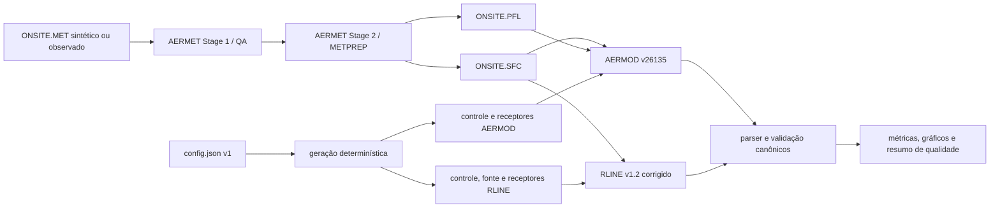

# Guia do projeto RLINE/AERMET/AERMOD

## Finalidade e limite da alegação

O repositório automatiza uma intercomparação de dispersão próxima a rodovias:
AERMET v26135 prepara meteorologia, AERMOD v26135 executa sua fonte `RLINE` e o
RLINE v1.2 standalone executa uma formulação histórica. O pacote Python valida,
combina e descreve os resultados.

A fonte `RLINE` entrou no AERMOD como beta na v19191, foi reformulada na v23132
e passou à configuração regulatória na v24142. Portanto, semelhança numérica
entre AERMOD v26135 e o standalone v1.2 não demonstra equivalência de códigos,
validade externa ou aprovação de um uso regulatório.

## Arquitetura



Responsabilidades:

| Local | Responsabilidade |
|---|---|
| `rline_pipeline/config.py` | JSON Schema, regras semânticas e grade decimal |
| `rline_pipeline/generation.py` | inputs dos modelos e invalidação de resultados antigos |
| `rline_pipeline/parsing.py` | estrutura, período, grade, grupo, rede e bijeção |
| `rline_pipeline/analysis.py` | agregação, merge espacial e métricas |
| `rline_pipeline/provenance.py` | verificação SHA-256 das baselines históricas |
| `scripts/lib/run_common.sh` | locks, timeout, staging, publicação e rollback |
| `scripts/scientific_regression.py` | regressão da variante corrigida contra goldens |

## Instalação e verificação rápida

Requisitos: Linux, Python 3.11+, GNU Make, GNU Fortran, `patch`, `flock`,
`setsid` e `sha256sum`.

```bash
python3 -m venv .venv
. .venv/bin/activate
bash .github/scripts/install-python-deps.sh
make model-provenance-check
make models
make test
make quality
python3 scripts/teste_casos.py
make quality-report
```

`model-provenance-check` fixa a identidade dos snapshots locais. Os manifests
de AERMET/AERMOD não alegam, sozinhos, igualdade com um ZIP oficial baixado em
outra data; veja `provenance/README.md`.

## Exemplo pequeno e seguro

O cenário padrão tem 24 horas, vento transversal, rodovia de 200 m e grade 5×5.
Tudo é gravado sob `build/`, que é descartável e ignorado pelo Git.

```bash
python3 scripts/gerar_dados_exemplo.py
bash scripts/run_aermet.sh build/examples/smoke-crosswind/meteorology
DIR_DADOS_AERMET=build/examples/smoke-crosswind/meteorology \
  bash scripts/run_caso.sh build/examples/smoke-crosswind/case
python3 scripts/teste_casos.py build/examples/smoke-crosswind/case
```

Outros cenários: `smoke-near-parallel` exercita a geometria de vento quase
paralelo e `mixed-diurnal` gera 120 horas. O gerador usa RNG local, semente
explícita e um manifesto de arquivos. `--replace-generated` só substitui um
bundle intacto criado pelo próprio gerador; conteúdo modificado é preservado e
causa falha segura.

## Execução confiável

Os wrappers constroem a rodada em staging, usam lock por destino, impõem timeout
ao grupo de processos e publicam somente arquivos novos que passam validações
estruturais. Cada execução gera log e manifesto JSON com hashes. Uma nova rodada
nunca deve ser apresentada como a baseline histórica versionada.

Para uma regressão publicável, use um worktree descartável e uma revisão limpa:

```bash
git worktree add --detach /tmp/rline-regression HEAD
cd /tmp/rline-regression
bash .github/scripts/install-python-deps.sh
bash .github/scripts/build-models.sh all
RUN_FULL_PIPELINE=1 bash .github/scripts/run-scientific-regression.sh
```

## Saídas e interpretação

- `CONC_PLOT.PLT`: média `PERIOD` do AERMOD, grupo `ALL`, rede `RCART`.
- `Output_Road_Numerical.csv`: série horária do RLINE por receptor.
- `resumo.txt` e `graficos/`: pós-processamento de uma rodada completa.
- `build/reports/quality-summary.json`: contrato do painel; valores ausentes
  permanecem `null`, acompanhados da limitação correspondente.

Somente integridade estrutural é um gate na comparação entre modelos. Os
resultados científicos devem ser interpretados conforme
[`VALIDACAO_CIENTIFICA.md`](VALIDACAO_CIENTIFICA.md).

## Fontes primárias

- [EPA — Preferred and Recommended Air Quality Models](https://www.epa.gov/scram/air-quality-dispersion-modeling-preferred-and-recommended-models)
- [EPA — 2024 Appendix W Final Rule](https://www.epa.gov/scram/2024-appendix-w-final-rule)
- [EPA HERO — artigo original do RLINE](https://hero.epa.gov/reference/2329610/)
- [EPA — Meteorological Guidance](https://www.epa.gov/scram/air-modeling-meteorological-guidance)
