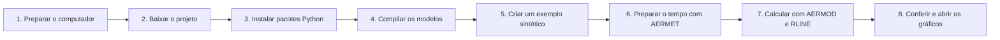

# Primeiros passos: do zero aos primeiros gráficos

Bem-vindo! Este guia foi escrito para quem está começando e talvez nunca tenha
compilado um programa, usado Python ou trabalhado com modelos atmosféricos.
Você não precisa entender Fortran para completar o tutorial.

Ao final, você terá executado um exemplo pequeno e encontrará:

- dois cálculos de concentração, um do AERMOD e outro do RLINE;
- uma validação que informa se os arquivos ficaram completos;
- dois gráficos em PNG;
- logs e manifests que registram o que foi executado.

Reserve aproximadamente 15 minutos para preparar o computador e alguns minutos
para compilar e executar. A duração depende da máquina e da internet.

## 1. Antes de começar: o mapa da viagem

Imagine que queremos descobrir como a fumaça de uma rodovia se espalharia:



O exemplo é deliberadamente pequeno: uma rodovia reta de 200 metros, uma grade
de 5 × 5 pontos e 24 horas de meteorologia sintética. Tudo que ele cria fica em
`build/`, uma pasta descartável. Os casos históricos do repositório não são
alterados.

### Três avisos importantes

1. **Use Linux.** No Windows, use Ubuntu dentro do WSL 2; não execute os scripts
   diretamente no PowerShell.
2. **Não use os dados sintéticos em decisões ambientais ou regulatórias
   reais.** Eles servem para aprender e testar o software.
3. **Digite os comandos na ordem apresentada.** Execute uma caixa por vez e só
   avance quando aparecer o ponto de conferência indicado.

Nos exemplos abaixo, o símbolo `$` representa o terminal. Não digite esse
símbolo. Linhas terminadas em `\` formam um único comando e podem ser copiadas
em conjunto.

## 2. Abrir um terminal Linux

### Se você já usa Ubuntu ou outra distribuição Linux

Abra o aplicativo chamado **Terminal** e vá para a seção 3.

### Se você usa Windows 10 ou 11

O projeto depende de ferramentas Linux. A forma recomendada é o WSL 2:

1. Abra o **PowerShell como administrador**.
2. Execute `wsl --install`.
3. Reinicie o computador se o Windows solicitar.
4. Abra o aplicativo **Ubuntu** e crie o usuário e a senha Linux solicitados.
5. A partir deste ponto, execute todo o tutorial no terminal Ubuntu.

As etapas e os requisitos atuais estão na
[documentação oficial do WSL](https://learn.microsoft.com/pt-br/windows/wsl/install).
Em computador corporativo, talvez seja necessária a ajuda do administrador.

> O macOS não é um ambiente suportado diretamente: os wrappers usam comandos
> Linux como `flock` e `setsid`. Use uma máquina virtual Linux se necessário.

## 3. Instalar os pré-requisitos

No Ubuntu ou Ubuntu/WSL, execute:

```bash
sudo apt update
sudo apt install -y git make gfortran patch python3 python3-venv python3-pip util-linux coreutils
```

`sudo` poderá pedir a senha criada no Linux. Enquanto você digita a senha, nada
aparece na tela; isso é normal. Pressione Enter ao terminar.

O que foi instalado:

| Programa | Para que serve aqui |
|---|---|
| Git | baixa o projeto e identifica sua versão |
| Python | gera entradas, confere resultados e cria gráficos |
| GNU Make | coordena a compilação |
| GNU Fortran | transforma os fontes dos modelos em programas executáveis |
| `patch` | aplica correções auditáveis ao RLINE em uma cópia temporária |
| `util-linux` e `coreutils` | fornecem locks, caminhos, hashes e limites de tempo |

## 4. Baixar o projeto

Escolha uma pasta de trabalho. Este exemplo usa sua pasta pessoal Linux:

```bash
cd ~
git clone https://github.com/paulopimenta6/rline_and_documentation.git
cd rline_and_documentation
```

Se você já havia baixado o projeto, não rode `git clone` outra vez. Entre na
pasta existente com `cd caminho/para/rline_and_documentation`.

### Ponto de conferência 1

```bash
pwd
ls README.md Makefile
bash scripts/verificar_ambiente.sh
```

O último comando apenas examina o computador. Quando tudo estiver disponível,
ele termina com:

```text
✅ Ambiente básico pronto. Continue em docs/PRIMEIROS_PASSOS.md.
```

Se aparecer `[FALTA]`, volte à seção 3 e confira o pacote indicado.

## 5. Criar o ambiente Python do projeto

Um ambiente virtual é uma “caixa” que guarda as bibliotecas deste projeto sem
misturá-las com outros programas Python do computador.

```bash
python3 -m venv .venv
source .venv/bin/activate
bash .github/scripts/install-python-deps.sh
```

Depois de `source`, é comum o terminal mostrar `(.venv)` antes do cursor. A
instalação baixa pacotes da internet e pode demorar alguns minutos.

### Ponto de conferência 2

```bash
python --version
python -m pip check
```

O Python deve ser 3.11 ou mais recente e `pip check` deve informar que não há
dependências quebradas.

Sempre que abrir um terminal novo para trabalhar no projeto, repita:

```bash
cd ~/rline_and_documentation
source .venv/bin/activate
```

Para sair do ambiente virtual, use `deactivate`.

## 6. Compilar os modelos

“Compilar” significa criar os programas executáveis a partir dos códigos-fonte.
Você só precisa repetir esta etapa depois de limpar `build/` ou alterar fontes.

```bash
make models
```

Antes da compilação, o projeto confere os hashes dos fontes. Mensagens de
compilação e alguns avisos Fortran podem aparecer. Um aviso não é
necessariamente uma falha; uma falha encerra o comando com `Error` ou `ERRO`.

### Ponto de conferência 3

```bash
ls -lh build/aermet/aermet \
  build/aermod/aermod \
  build/rline-patched/RLINEv1_2_patched.x
```

Os três caminhos devem existir. Não mova esses arquivos: os scripts já sabem
onde encontrá-los.

## 7. Criar um exemplo seguro

Vamos chamar a primeira experiência de `meu-primeiro-teste`:

```bash
python scripts/gerar_dados_exemplo.py --name meu-primeiro-teste
```

O comando cria duas partes:

```text
build/examples/meu-primeiro-teste/
├── meteorology/     dados sintéticos e controles do AERMET
├── case/            rodovia, emissão e receptores
├── EXECUCAO.md      comandos específicos deste exemplo
└── example-manifest.json
```

O manifesto contém os hashes dos arquivos iniciais. Ele funciona como o lacre
de uma caixa: se alguém alterar o conteúdo, o gerador não o sobrescreve por
engano.

### Ponto de conferência 4

```bash
cat build/examples/meu-primeiro-teste/meteorology/synthetic-data-qa.json
```

Procure por `"synthetic": true` e `"periods": 24`.

## 8. Preparar a meteorologia com AERMET

O AERMET recebe as observações meteorológicas do exemplo e cria os arquivos que
os dois modelos entendem:

```bash
bash scripts/run_aermet.sh build/examples/meu-primeiro-teste/meteorology
```

### Ponto de conferência 5

No fim da saída, procure:

```text
>>> AERMET OK: ONSITE.SFC e ONSITE.PFL publicados
```

Os arquivos estarão em:

```bash
ls -lh build/examples/meu-primeiro-teste/meteorology/ONSITE.SFC \
  build/examples/meu-primeiro-teste/meteorology/ONSITE.PFL
```

## 9. Executar AERMOD, RLINE e os gráficos

Agora informamos onde está a meteorologia e executamos o caso:

```bash
DIR_DADOS_AERMET=build/examples/meu-primeiro-teste/meteorology \
  bash scripts/run_caso.sh build/examples/meu-primeiro-teste/case
```

Esse script executa AERMOD e RLINE, confere suas saídas e cria os gráficos. O
trabalho acontece primeiro em uma área temporária; arquivos incompletos não são
publicados como se fossem resultados válidos.

### Ponto de conferência 6

Procure a mensagem:

```text
=== CASO CONCLUIDO E PUBLICADO: .../meu-primeiro-teste/case ===
```

Se ela apareceu, a execução dos modelos foi concluída.

## 10. Conferir o resultado

Execute o validador:

```bash
python scripts/teste_casos.py build/examples/meu-primeiro-teste/case
```

O final esperado é:

```text
Casos reportados: 1/1
VALIDACAO ESTRUTURAL APROVADA; INTERCOMPARACAO REPORTADA SEM GATE CIENTIFICO
```

Como ler a saída:

| Sinal | Significado |
|---|---|
| `[PASS] T1–T4` | os programas terminaram e os arquivos têm estrutura coerente |
| `[INFO] T5–T8` | medidas para comparar os modelos; não são aprovação ou reprovação |
| `[FAIL]` | a execução está incompleta ou inconsistente; leia a mensagem ao lado |

AERMOD e RLINE não são duas cópias do mesmo programa. Portanto, valores
diferentes entre eles não significam automaticamente que um esteja “errado”.

## 11. Ver os primeiros gráficos

Liste os gráficos:

```bash
ls -lh build/examples/meu-primeiro-teste/case/graficos/
```

Você encontrará:

- `conc_periodo_rline.png`: mapa das concentrações calculadas;
- `conc_aermod_vs_rline.png`: comparação entre os dois modelos.

Em um Linux com interface gráfica, tente:

```bash
xdg-open build/examples/meu-primeiro-teste/case/graficos/conc_aermod_vs_rline.png
```

No WSL, também é possível abrir a pasta pelo Explorador de Arquivos do Windows
e navegar até `build/examples/meu-primeiro-teste/case/graficos/`.

O resumo em texto pode ser lido no terminal:

```bash
cat build/examples/meu-primeiro-teste/case/resumo.txt
```

## 12. O que é seguro apagar ou repetir?

Tudo em `build/` é reconstruível. Para limpar todos os programas compilados,
exemplos e relatórios locais:

```bash
make clean
```

Depois disso, será necessário executar `make models` novamente.

Se quiser fazer outra experiência sem limpar nada, escolha outro nome:

```bash
python scripts/gerar_dados_exemplo.py \
  --scenario smoke-near-parallel \
  --name meu-segundo-teste
```

Não use `--replace-generated` depois de executar um caso: a pasta terá novos
resultados e logs, e a proteção recusará a substituição. Um nome novo é a opção
mais simples e segura.

## 13. Problemas comuns

### `python3: command not found` ou `gfortran: command not found`

O requisito não foi instalado. Repita a seção 3 e depois rode
`bash scripts/verificar_ambiente.sh`.

### `No module named ...`

O ambiente virtual não está ativo ou as dependências não foram instaladas:

```bash
source .venv/bin/activate
bash .github/scripts/install-python-deps.sh
```

### `destino ja existe`

O nome do exemplo já foi usado. Escolha outro valor para `--name`. Essa recusa
evita apagar resultados sem querer.

### `binario ... nao encontrado`

Execute `make models`. Se a compilação falhar, procure a primeira linha contendo
`Error` ou `ERRO`, pois mensagens posteriores podem ser apenas consequência.

### `ja existe uma execucao ... no destino`

Outro processo pode estar trabalhando na mesma pasta. Espere a execução
terminar. Se nenhum processo estiver ativo, preserve os logs e peça ajuda antes
de remover arquivos de lock manualmente.

### Aviso sobre `.config/matplotlib` não gravável

O Matplotlib cria um cache temporário e normalmente continua funcionando. Para
definir um cache dentro de `build/`, execute antes do comando Python:

```bash
export MPLCONFIGDIR="$PWD/build/matplotlib-cache"
mkdir -p "$MPLCONFIGDIR"
```

### O terminal parece parado

Modelos Fortran podem ficar alguns minutos sem imprimir novas linhas. Não feche
o terminal imediatamente. Os wrappers possuem limites de tempo e registrarão
uma mensagem clara se uma etapa expirar.

## 14. Glossário sem jargão

| Palavra | Significado neste projeto |
|---|---|
| concentração | quantidade calculada de poluente em um ponto |
| emissão | quantidade de poluente liberada pela rodovia |
| receptor | ponto do mapa onde a concentração é calculada |
| grade | conjunto organizado de receptores |
| meteorologia | vento, temperatura, turbulência e outras condições do tempo |
| cenário/caso | uma combinação de rodovia, emissão, grade e período |
| modelo | programa que representa matematicamente a dispersão |
| pipeline | sequência automatizada das etapas |
| build | pasta descartável com programas e resultados gerados |
| hash | impressão digital usada para detectar alteração de arquivo |
| manifesto | registro dos arquivos, versões e hashes de uma execução |
| baseline/golden | resultado de referência preservado para detectar mudanças |
| log | diário textual de uma execução |

## 15. Próximo passo

Depois de concluir o exemplo:

- para entender cada campo de entrada, leia
  [Formatos de entrada](FORMATOS_DE_ENTRADA.md);
- para entender PASS, INFO e métricas, leia
  [Validação científica](VALIDACAO_CIENTIFICA.md);
- para criar um caso próprio, comece por `config.json` e pelo
  [Guia do projeto](GUIA_PROJETO.md);
- para desenvolvimento e reprodução científica, consulte o
  [índice da documentação](README.md).

Lembre-se: completar o tutorial confirma que o software funciona no seu
computador. Isso não transforma o cenário sintético em evidência sobre uma
rodovia real.
