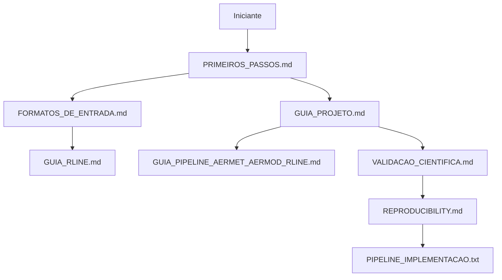

# Índice da documentação

Não é necessário ler tudo. Escolha abaixo o caminho mais próximo do seu
objetivo.

## Por onde começar?

| Seu perfil ou objetivo | Documento recomendado |
|---|---|
| Nunca usei o projeto ou o terminal | [Primeiros passos](PRIMEIROS_PASSOS.md) |
| Quero preparar meus próprios dados | [Formatos de entrada](FORMATOS_DE_ENTRADA.md) |
| Quero entender o funcionamento geral | [Guia do projeto](GUIA_PROJETO.md) |
| Quero interpretar métricas e limites | [Validação científica](VALIDACAO_CIENTIFICA.md) |
| Quero reproduzir resultados com rigor | [Reprodutibilidade](REPRODUCIBILITY.md) |
| Quero saber o que ainda falta melhorar | [Roadmap](ROADMAP_MELHORIAS.md) |
| Quero contribuir com código | [Guia de contribuição](../CONTRIBUTING.md) |

## Mapa de profundidade



Os documentos na raiz `GUIA_RLINE.md`,
`GUIA_PIPELINE_AERMET_AERMOD_RLINE.md`, `PLANO_Compilacao_Uso_RLINE.md` e
`PIPELINE_IMPLEMENTACAO.txt` são referências técnicas detalhadas. Eles são úteis
depois do primeiro tutorial, mas não são pré-requisitos para executar o exemplo.

## Ajuda rápida

Antes de abrir uma issue, rode:

```bash
bash scripts/verificar_ambiente.sh
make docs-check
make test
make quality
```

Ao pedir ajuda, informe o sistema operacional, a saída do diagnóstico, o comando
executado e a primeira mensagem de erro. Não envie apenas uma captura da última
linha: a causa costuma aparecer um pouco antes no log.
